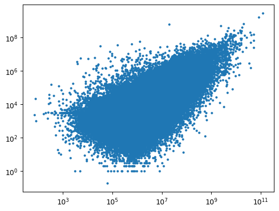

## Visualising The Data

Visualising the data on a log-scale shows a logaraithmic relationship between *t* and *p*

## Models and Results

| Model                       | RMSE        | MAE           | R2   |
| --------------------------- | ----------- | ------------- | ---- |
| Linear Regression           | 13097353.00 | 319709.08     | 0.10 |
| Random Forest (Logged Data) | 1.81        | 1.41          | 0.19 |
| Logged Linear Regression    | 1.58        | 1.23          | 0.38 |
| XGBoost (Logged Data)       | 1.53        | 1.18          | 0.42 |
| AdaBoost (Logged Data)      | 1.56        | 1.21          | 0.39 |
| Gradient Boost (Logged Data)| 1.53        | 1.18          | 0.42 |
| CatBoost (Logged Data)      | 1.53        | 1.18          | 0.42 |
| YDF (logged Data)           | 1.53        | 1.18          | 0.42 |
